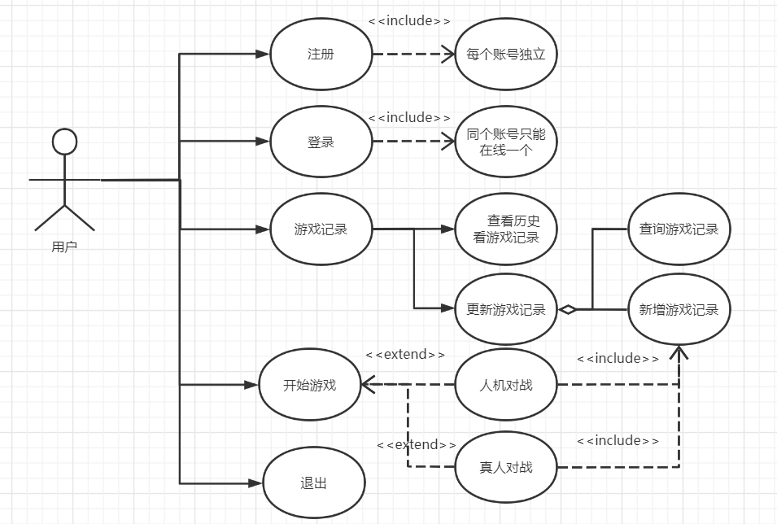
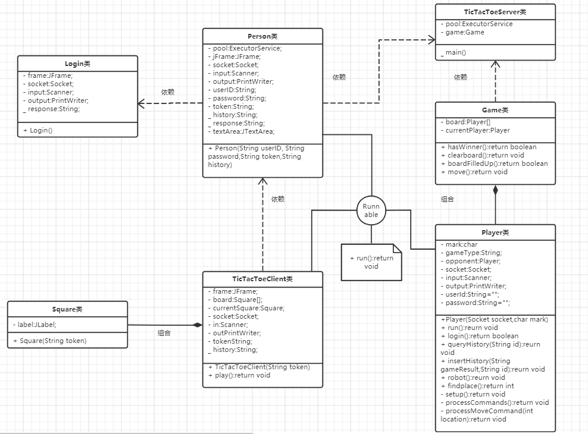
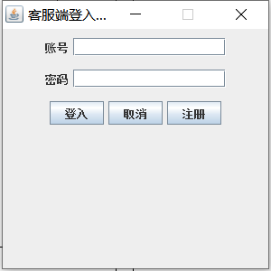
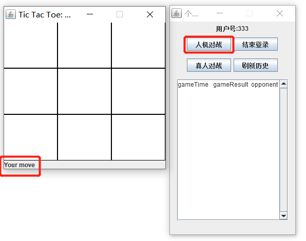
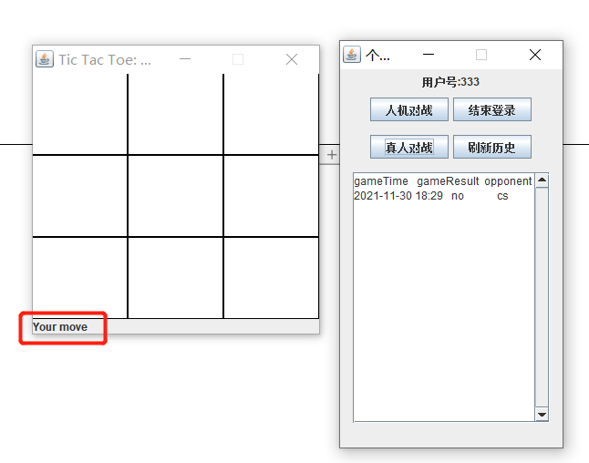
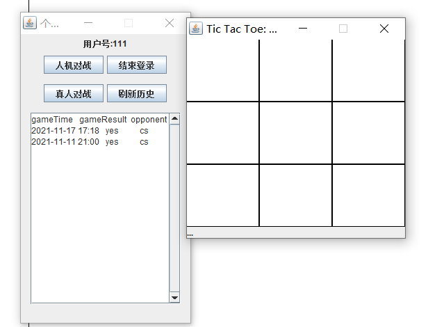
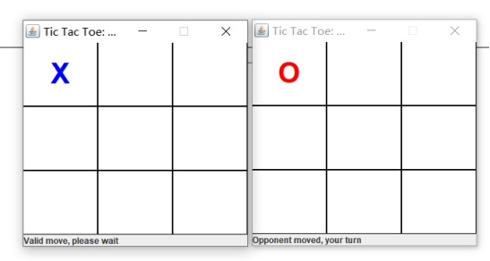
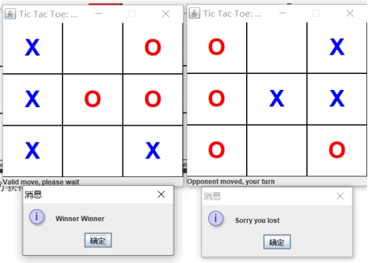
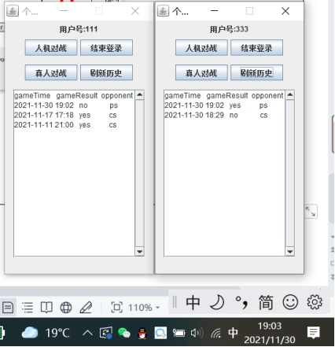

### 说明

先运行服务端代码后运行客户端，先弹出登录窗口。

用户可在登录窗口点击注册按钮注册新用户，输入正确的账号密码后即可跳转到个人中心界面，且设置同个用户不可重复登录。

在其中有人机对战，真人对战和刷新窗口展示当前用户游戏记录的按钮。点击人机对战按钮会弹出游戏窗口即可进行游戏，点击棋盘空白处即可下棋；点击真人对战按钮需要等待另外一个用户也进入真人对战才可以进行游戏。

游戏结束后，可以在个人中心界面点击刷新游戏记录按钮，即可看到最新的游戏记录。

1. 采用基于TCP的socket操作进行通信，每次轮询都使用accept阻塞监听等待两个新的连接，且每次进行游戏时都需要清空棋盘之前的标记，防止前个连接的操作痕迹影响后续新的游戏操作

2. 数据库操作选用C3P0数据库连接池以及手动编写的JDBCUtils工具类进行简化操作

### 用例图

### 类图

### 登录窗口

### 人机对战

  点击个人中心中人机对战的按钮，弹出人机对战窗口，下栏有提示信息提示当前回合信息

### **真人对战**

用户333提示当前是它的回合。

两个用户都会进行接受到消息并进行画图，且切换游戏回合为对手用户

某一方获得胜利或者棋盘都下满被迫平局

