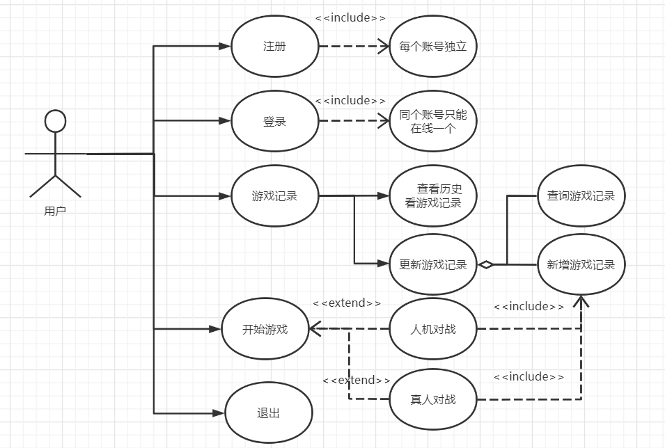
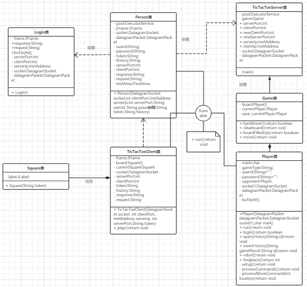
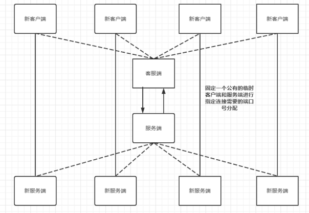

用例图

类图

本次实验才有架构如下：

 

固定一个公有的临时客户端和服务端进行指定连接需要的端口号分配，只要用新的客户端和新的服务端重新UDP通信连接后，就把原来的客户端和服务端断开。这种临时的连接，保证了不同用户可以同时进行登录操作，同时因为采用新的指定客户端和新的服务端端口号，可以保证不同客服端和不同服务端进行通信不会受到干扰。

由于UDP是一种不可靠的协议，所以在测试阶段，如果只能发一次信息，可能存在丢包的情况，导致端口一直在recieve等待接受UDP报文包，导致程序逻辑出现错误。解决方法有重试重传和多次发送且需要巧妙设计区分UDP报文数据包发送的信息。